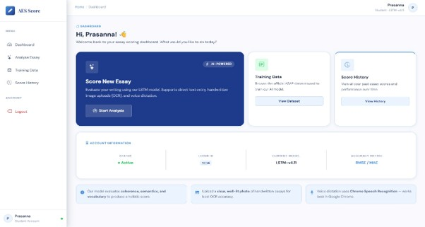
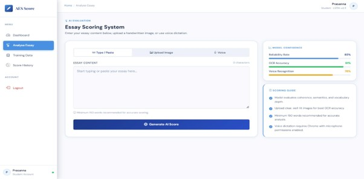
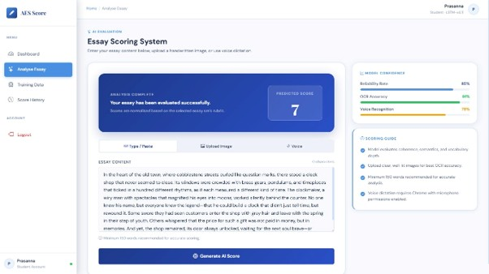

# Automatic English Essay Scoring System

## Project Overview
This project is an AI-based web application that automatically evaluates English essays using Machine Learning and Deep Learning techniques. It supports text input, OCR (Image to Text), and Voice Input for essay evaluation.

## Features
- User Registration & Login
- Essay Text Input
- OCR (Image to Text)
- Voice to Text
- Automatic Essay Scoring
- AI-based Score Prediction using LSTM
- User Dashboard
- Essay History

## Technologies Used
- Python
- Django
- TensorFlow
- Machine Learning
- Deep Learning (LSTM)
- Natural Language Processing (NLP)
- Word2Vec
- HTML
- CSS
- JavaScript
- SQLite

## Installation

```bash
git clone https://github.com/kattaprasannakumari3-del/Automatic-English-Essay-Scoring.git

cd Automatic-English-Essay-Scoring

pip install -r requirements.txt

python manage.py runserver
```

## Project Screenshots

### Login Page


### Dashboard



### Essay Input Page



### Essay Scoring Result



## Future Scope

- Grammar Error Detection
- Multi-language Essay Evaluation
- AI-based Feedback Generation
- Cloud Deployment
- Mobile Application Support

## Author

**Katta Prasanna Kumari**

MCA Final Year Project
